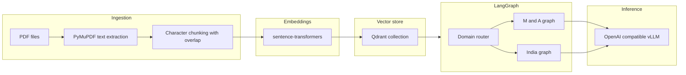

# Legal & Property Document Intelligence — Full Project Documentation and Rebuild Guide

This document describes **everything that was built** in the AMD Hackathon codebase: **purpose**, **research rationale**, **correlations between business context and engineering choices**, **architecture**, **data structures**, **prompts**, **configuration**, **deployment**, **testing**, and a **step-by-step recipe to recreate the project without reading the source tree**.

The intended reader is someone who has **only this document** and needs to **re-implement the same system** (or audit it for parity).

---

## 1. Executive summary

### 1.1 What this product is

A **dual-domain document intelligence agent** that:

1. **M&A / contract diligence (`mna`)** — Ingests PDF contracts, retrieves relevant chunks via vector search, runs **five specialist LLM passes** (obligations, risks, cross-document consistency, compliance), then **synthesizes** an internal due diligence memo. This matches the classic “legal document intelligence agent” hackathon thesis (Harvey-class workflow, on-prem friendly).

2. **India real-estate / property packet diligence (`india_re`)** — Ingests property-related PDFs (sale deeds, EC, mutation extracts, RoR/RTC-style text, etc.), retrieves context with **India-specific query biasing**, **extracts structured `InstrumentFact` JSON per document**, builds a deterministic **TitleGraph** (heuristic chain + break detection), runs **three specialist LLM passes** (chain/continuity, encumbrance/dispute, records-system context), then **synthesizes** a memo with an explicit **presumptive-titling / non-guarantee disclaimer**.

Both domains share: **PyMuPDF ingestion**, **sentence-transformers embeddings**, **Qdrant** vector store, **LangGraph** orchestration, **OpenAI-compatible Chat Completions** (designed for **vLLM** on **AMD MI300X** / ROCm in production), and a **Streamlit** UI plus **`legal-diligence` CLI**.

### 1.2 Why two domains in one repo

- **Commercial / hackathon narrative**: The original AMD brief centers on **large-model legal M&A diligence** (70B, long context, RAG, agents).
- **Regional product wedge**: The **India property** flow addresses a **different but structurally similar** bottleneck: **assembling a defensible “property dossier”** from heterogeneous scans and records under a **presumptive** land regime—without claiming **guaranteed title**.

Engineering reuse: **same inference surface**, **same RAG stack**, **same agent framework**; only **prompts**, **post-retrieval structured extraction**, and **deterministic graph logic** differ.

---

## 2. Business, research, and product reasoning

### 2.1 AMD MI300X and the “legal AI” thesis (M&A track)

**Stated problem**: Legal document review is expensive; **hallucination** in AI-assisted legal research is a documented failure mode; **larger models** and **long context** generally improve reasoning but **increase memory** (model weights + **KV cache** for long sequences).

**Hardware correlation**: **MI300X** (large HBM pool) is positioned to run **70B-class** models in a **single-GPU** serving configuration where **80GB-class** GPUs may require **tensor parallelism**—adding latency and ops complexity. The product is **inference-heavy** (RAG + multi-step agents), which aligns with **ROCm + vLLM** maturity for serving.

**Product implication**: The prototype **does not** need to prove new ML theory; it must show **agentic workflow**, **grounded outputs**, **source attribution via RAG chunks**, and a **clean path to on-prem** (OpenAI-compatible API to a self-hosted vLLM).

### 2.2 India real-estate / title intelligence track

**Stated problem**:

- India’s land record environment is often described as **presumptive**: **registration records a transaction**; it does **not** automatically equal **conclusive, government-guaranteed title** in the way a full **Torrens-style** guarantee might. Buyers bear **due diligence burden** (policy and legal commentary often emphasize this distinction).
- **Fragmentation** across **registration**, **revenue/RoR**, **survey**, and **courts** creates **integration and consistency** problems—exactly why a **dossier + gap analysis** product can be commercially valuable even when **conclusive title** cannot be automated.

**Product wedge (honest positioning)**:

| Claim the product can support | Claim the product must not make |
|------------------------------|----------------------------------|
| Faster structuring of messy packets | “Guaranteed ownership everywhere” |
| Evidence-linked excerpts and memo | Conclusive legal adjudication |
| Visible **gaps**, **anomalies**, **risk flags** | Pretending digitization implies correctness |

**Correlation to architecture**:

- **TitleGraph** in **code** (not only LLM prose) encodes **“continuity vs break”** as a **first-class artifact** for UI and benchmarks.
- **Structured extraction** (`InstrumentFact`) forces **fields + evidence** to be explicit, supporting **auditability**.
- **Specialist prompts** forbid **inventing** DILRMP/ULPIN/NGDRS/e-courts details unless they appear in retrieved text.

### 2.3 Enterprise “pilot vs production” gap (cross-cutting)

Research cited in the hackathon brief (e.g. high GenAI adoption vs low **production** agent maturity) implies **trust mechanics** matter: **provenance**, **human-in-the-loop**, **explicit unknowns**. The implementation **encodes** provenance via **chunk headers** (`doc_id`, `doc_label`, retrieval score) and **evidence** fields in India extraction.

---

## 3. High-level architecture

### 3.1 Component diagram (logical)



### 3.2 Runtime data flow (shared)

1. **PDF → text** (full document string + page count).
2. **Text → chunks** (fixed character length + overlap; approximate page ranges per chunk).
3. **Chunks → embeddings** (dense vectors, cosine similarity in Qdrant).
4. **User query (+ domain-specific suffix for India retrieval)** → **vector search** → **ranked chunks** formatted as a **single context block** string.
5. **LangGraph** invokes **one or more LLM calls** depending on domain; outputs accumulate in a **typed state** object.
6. **Streamlit / CLI** displays **`final_report`** and optional intermediate JSON.

### 3.3 Qdrant: single collection, payload-scoped filtering

- **Collection**: one (configurable name, default `legal_chunks`).
- **Vector**: one embedding per chunk; distance **cosine**.
- **Payload fields** (minimum): `doc_id`, `doc_label`, `chunk_index`, `text`, plus `page_start`, `page_end`, `page_count` where applicable.
- **Filtering**: India extraction uses **`doc_id` equality filter** during search so per-document retrieval is possible.

**Critical implementation detail**: For `QDRANT_URL=:memory:`, the system uses a **single process-wide cached client** so all `LegalVectorStore()` instances share one in-memory database (otherwise ingest and retrieve would see different empty DBs).

---

## 4. Technology stack (exact dependency intent)

| Layer | Technology | Role |
|-------|-------------|------|
| Language | Python **≥ 3.11** | Runtime |
| Packaging | `pyproject.toml` + setuptools `src/` layout | Installable package `legal_intel` |
| Orchestration | **LangGraph** | State machine for multi-step agents |
| LLM client | **langchain-openai** `ChatOpenAI` | OpenAI-compatible `/v1/chat/completions` to **vLLM** |
| Vector DB | **qdrant-client** ≥ 1.12 | `query_points` API with optional `query_filter` |
| Embeddings | **sentence-transformers** | Default model `sentence-transformers/all-MiniLM-L6-v2` (384-dim) |
| PDF | **PyMuPDF** (`fitz`) | Text extraction (not OCR) |
| Config | **pydantic-settings** | `.env` loading |
| UI | **Streamlit** | Demo |
| Tests | **pytest** | Unit + integration |

**Not included (by design in MVP)**: OCR, government portal APIs, multilingual pipelines, fine-tuned legal models.

---

## 5. Repository layout (what to recreate)

```
AMD_Hackathon/
  pyproject.toml
  docker-compose.yml          # Qdrant only
  .env.example
  README.md
  streamlit_app.py
  scripts/
    eval_india.py
  src/
    legal_intel/
      __init__.py
      config.py
      cli.py
      privacy.py
      prompts.py                 # M and A specialist prompts + format_context_block
      pipeline.py                # ingest_pdf
      ingest/
        pdf_loader.py
      rag/
        embeddings.py
        store.py
      llm/
        client.py
      graph/
        state.py
        build.py                 # build_graph, build_graph_india, runners
      india/
        __init__.py
        schemas.py
        title_graph.py
        prompts_india.py
        extraction.py
  tests/
    conftest.py
    test_chunking.py
    test_graph_mock.py
    test_india_graph_mock.py
    test_title_graph.py
    fixtures/india_packets/expected.json
```

---

## 6. Configuration reference (environment variables)

All settings are defined in `legal_intel.config.Settings` (pydantic-settings). Environment variable names follow **upper snake** convention.

| Variable | Purpose | Typical value |
|----------|---------|----------------|
| `OPENAI_API_BASE` | Base URL for OpenAI-compatible API | `http://localhost:8000/v1` |
| `OPENAI_API_KEY` | API key (vLLM often accepts placeholder) | `EMPTY` |
| `LLM_MODEL` | Model id as known to the server | `meta-llama/Llama-3.1-70B-Instruct` |
| `LEGAL_INTEL_MOCK_LLM` | If true: skip remote LLM; return stub text (and India extraction uses heuristic mock) | `0` or `1` |
| `EMBEDDING_MODEL` | sentence-transformers model id | `sentence-transformers/all-MiniLM-L6-v2` |
| `QDRANT_URL` | Qdrant HTTP endpoint or `:memory:` | `http://localhost:6333` |
| `QDRANT_COLLECTION` | Collection name | `legal_chunks` |
| `DILIGENCE_DOMAIN` | `mna` or `india_re` | `india_re` (default in code) |
| `EXTRACTION_MAX_PAGES` | Caps character window for India extraction via `max_pages * 3500` chars (min 4000) | `10` |
| `TITLEGRAPH_NAME_FUZZY_THRESHOLD` | `difflib` ratio threshold for buyer/seller link | `0.82` |

**Chunking / retrieval defaults** (code defaults): `chunk_size=1200`, `chunk_overlap=200`, `retrieval_top_k=12`.

---

## 7. Ingestion and chunking (shared)

### 7.1 Document ID

`doc_id = f"{pdf_stem}_{sha256(resolved_path)[:16]}"` so re-ingesting the same path yields a stable id within a session; different paths produce different ids.

### 7.2 Chunking algorithm

- Normalize whitespace.
- Sliding window: `chunk_size` characters, advance by `chunk_size - chunk_overlap`.
- **Page metadata**: Because chunking is on a **flattened string**, `page_start` / `page_end` are **interpolated** from character offset vs total length and total **page_count**—they are **approximate**, not a strict PDF layout map.

### 7.3 Payload stored per chunk

Each upserted point includes:

- `doc_id`, `doc_label`, `chunk_index`, `text`
- `page_start`, `page_end`, `page_count`

---

## 8. Retrieval and context formatting

### 8.1 Vector search

- Embed the **query string** with the same embedding model used at ingest.
- Call Qdrant `query_points` with:
  - `query` = dense vector
  - `limit` = top-k
  - optional `query_filter` on `doc_id` for India per-document retrieval

### 8.2 `format_context_block(hits)`

Each hit becomes a block:

```text
[i] doc=<doc_id> (<doc_label>) score=<score>
<text>
---
```

If no hits: `(No retrieved context — index documents first.)`

This string is what **all specialist agents** consume as **CONTEXT**.

---

## 9. LLM integration contract

### 9.1 Interface

Function **`chat_complete(system: str, user: str, *, temperature, max_tokens) -> str`**:

- If `LEGAL_INTEL_MOCK_LLM` is true: return a deterministic stub string containing `[MOCK LLM]` and a short prefix of the system prompt (for tests and UI without GPU).
- Else: `ChatOpenAI(base_url=OPENAI_API_BASE, api_key=OPENAI_API_KEY, model=LLM_MODEL)` with messages `[SystemMessage(system), HumanMessage(user)]`.

### 9.2 India structured extraction

- System prompt **`EXTRACTION_SYSTEM`** requires **raw JSON only** (no markdown fences), with a fixed key set matching **`InstrumentFact`**.
- Parse JSON robustly: strip optional fences; regex-extract first `{...}` if needed.
- On validation failure: **one retry** with the invalid output appended and instructing “ONLY valid JSON.”
- **Mock path**: regex/heuristic extraction from context text into a valid `InstrumentFact` (for CI).

---

## 10. Domain A — M&A diligence (`mna`)

### 10.1 Graph topology

**Linear** pipeline:

`START → retrieve → obligations → risks → cross_ref → compliance → synthesize → END`

### 10.2 State shape (`DiligenceState`)

TypedDict keys (all optional in practice but populated in order):

- `user_query`
- `retrieved_context`
- `obligation_section`, `risk_section`, `cross_ref_section`, `compliance_section`
- `final_report`

### 10.3 Retrieval query for M&A

Combine user query with:

> “Extract obligations, risks, cross-document inconsistencies, regulatory hooks from contracts.”

### 10.4 Specialist prompt intents (summary)

| Node | Intent |
|------|--------|
| Obligations | Deadlines, deliverables, payment terms — **only from context** |
| Risks | Indemnity, caps, MAE, etc. — severity flags |
| Cross-ref | SPA vs schedules style consistency — **only from context** |
| Compliance | High-level frameworks **only if** grounded in context |
| Synthesis | Internal memo combining sections; attribute to “provided excerpts” |

### 10.5 API

- `run_diligence(user_query: str) -> DiligenceState`

---

## 11. Domain B — India property diligence (`india_re`)

### 11.1 Graph topology

`START → retrieve → extract_facts → build_titlegraph → chain → encumbrance → records → synthesize → END`

### 11.2 State shape (`IndiaDiligenceState`)

- `user_query`
- `doc_ids: list[str]` — **required for extraction** (must match ingested `doc_id`s)
- `doc_labels: dict[str, str]` — filename → human label per `doc_id`
- `retrieved_context` — global India-biased retrieval
- `instrument_facts_json` — JSON array string of `InstrumentFact` dicts
- `title_graph_json` — JSON string from `TitleGraph.to_json()`
- `chain_section`, `encumbrance_section`, `records_section`
- `final_report`

### 11.3 Retrieval query for India

**User query + `RETRIEVAL_QUERY_SUFFIX`**, a fixed string of Indian property keywords (mutation, EC, RoR, RTC, khata, patta, ULPIN, sale deed, gift, partition, etc.) to bias dense retrieval toward relevant chunks.

### 11.4 Per-document extraction flow

For each `doc_id` in `doc_ids`:

1. `search(user_query + suffix, limit=max(8, retrieval_top_k), doc_id=doc_id)`
2. If still empty, fall back to unfiltered search and **filter hits in Python** by `doc_id`, then format context.
3. `extract_instrument_fact(doc_id, doc_label, context_text)`
4. Append to list → serialize to `instrument_facts_json`.

### 11.5 TitleGraph — deterministic logic

**Data structure**:

- `nodes: dict[doc_id, InstrumentFact]`
- `edges: list[(from_doc_id, to_doc_id, relation)]`

**Linking heuristic (`link_transfer_chain`)**:

- For each ordered pair of distinct documents `A`, `B`, for each **buyer name** in `A` and **seller name** in `B`, if **fuzzy match** ≥ `TITLEGRAPH_NAME_FUZZY_THRESHOLD` using normalized strings and `difflib.SequenceMatcher`, add edge `(A.doc_id, B.doc_id, "possible_transfer_chain")`.

**Break detection (`detect_breaks`)** produces a list of issue dicts:

- **orphan_or_unlinked**: node not part of any edge when there are >1 nodes
- **large_year_gap**: consecutive dated instruments >50 years apart (sorted by year extracted from `execution_date` / `registration_date` via regex `(19|20)dd`)
- **parcel_id_drift**: for an edge, if both ends have non-empty `parcel_ids` but **no intersection** (case-insensitive), flag drift

**Serialization (`to_json`)**:

```json
{
  "nodes": { "<doc_id>": { ... InstrumentFact ... } },
  "edges": [ {"from": "...", "to": "...", "relation": "..."} ],
  "breaks": [ { "kind": "...", ... } ]
}
```

### 11.6 India specialist LLM steps

| Node | Inputs | Output key |
|------|--------|------------|
| `chain` | `TITLE_GRAPH_JSON` + global `retrieved_context` + user query | `chain_section` |
| `encumbrance` | global `retrieved_context` + user query | `encumbrance_section` |
| `records` | global `retrieved_context` + user query | `records_section` |
| `synthesize` | user query + `title_graph_json` + all three sections | `final_report` |

**Synthesis system prompt** mandates numbered sections including **DISCLAIMER**: assistive only, not legal advice, no ownership guarantee, presumptive records.

### 11.7 API

- `run_diligence_india(user_query, doc_ids, doc_labels?) -> IndiaDiligenceState`
- `run_diligence_auto(user_query, doc_ids?, doc_labels?)` — if `DILIGENCE_DOMAIN == india_re`, runs India graph; else M&A graph.

---

## 12. User interfaces

### 12.1 Streamlit (`streamlit_app.py`)

- Page title: **Property Diligence Copilot (India)** (branding emphasis).
- **Prominent error/warning banner** stating presumptive titling and non-advice.
- Sidebar: **radio** to choose `india_re` vs `mna` (defaults from `DILIGENCE_DOMAIN` env).
- File uploader: PDFs; on first upload per filename, writes temp file, calls `ingest_pdf`, stores `doc_id` and chunk count in `st.session_state`, maintains `india_doc_ids` and `india_doc_labels`.
- **India run**: `run_diligence_india(query, india_doc_ids, india_doc_labels)`
- **M&A run**: `run_diligence(query)`
- Expanders: India shows TitleGraph JSON, instrument facts JSON, chain/encumbrance/records, retrieved context; M&A shows legacy four sections.

### 12.2 CLI (`legal-diligence`)

- Arguments: one or more PDF paths, `-q/--query`, optional `--domain mna|india_re`, optional `--json`.
- Ingests each PDF, collects `doc_ids` and labels (path strings).
- If `india_re` (explicit or from settings): `run_diligence_india`; else `run_diligence`.
- `--json`: `print(json.dumps(dict(state)))` (use `default=str` if needed for non-JSON types).

---

## 13. Privacy and governance (light implementation)

- **`legal_intel.privacy.redact_aadhaar_like`**: regex-based masking of 12-digit-like patterns — **best-effort**, documented as **not** a compliance guarantee.
- README-level guidance: **DPDP 2023** awareness, minimize PII in logs, limited retention for demos.

---

## 14. Evaluation and testing

### 14.1 `scripts/eval_india.py`

Inputs:

- `expected.json` containing optional `instrument_facts` (gold partial fields), `expect_chain_break` (bool)
- `actual.json` from a full run (must include `instrument_facts_json`, `title_graph_json`, `final_report`)

Outputs JSON scores:

- **`field_f1_macro`**: token-set F1 on `buyer_names`, `seller_names`, `parcel_ids` per aligned pairs (if lists present)
- **`chain_break_accuracy`**: compares whether `breaks` non-empty matches `expect_chain_break`
- **`groundedness_proxy`**: 1.0 if memo contains `p.`, `[page`, or `excerpt` (crude proxy)

### 14.2 Tests (what they assert)

| Test file | Purpose |
|-----------|---------|
| `test_chunking.py` | Chunking produces multiple chunks with overlap |
| `test_graph_mock.py` | M&A graph runs with mock LLM + in-memory Qdrant; search returns hits |
| `test_title_graph.py` | TitleGraph links/finds breaks without LLM |
| `test_india_graph_mock.py` | India graph end-to-end; `doc_id` filter search works |

**`tests/conftest.py`** sets by default:

- `LEGAL_INTEL_MOCK_LLM=1`
- `QDRANT_URL=:memory:`
- `DILIGENCE_DOMAIN=mna` — **critical** so M&A regression tests use M&A graph even though application default is `india_re`.

---

## 15. Docker and deployment

### 15.1 `docker-compose.yml`

- Service **qdrant** image `qdrant/qdrant:v1.12.4`, ports 6333/6334, persistent volume.

### 15.2 vLLM on ROCm (conceptual — not wired in repo)

Hackathon deployment assumes:

- Pull **`vllm/vllm-openai-rocm`** (or current AMD-recommended image).
- Enable **`VLLM_ROCM_USE_AITER=1`** (and other ROCm env vars per AMD docs).
- Serve model with OpenAI-compatible API; set `OPENAI_API_BASE` to `http://host:port/v1`.

The **application** only needs a **Chat Completions**-compatible endpoint.

---

## 16. Limitations and known gaps

1. **No OCR**: scanned PDFs without a text layer yield empty or poor text; production needs OCR upstream.
2. **Heuristic TitleGraph**: not a legal determination; name matching can false-positive/negative.
3. **Approximate page mapping** in chunks for long documents.
4. **Mock LLM** does not test real model quality; only plumbing.
5. **Eval script** metrics are **intentionally simple**; replace with labeled datasets for credible benchmarks.

---

## 17. Step-by-step rebuild recipe (from zero)

### 17.1 Create project skeleton

1. Create `pyproject.toml` with dependencies listed in §4 and `[tool.setuptools.packages.find] where = ["src"]`.
2. Create package `src/legal_intel/` with subpackages `ingest`, `rag`, `llm`, `graph`, `india`.
3. Add `docker-compose.yml` for Qdrant as in §15.

### 17.2 Implement config

- `pydantic-settings` `Settings` with fields in §6.
- `get_settings()` returning a new `Settings()` instance (no global cache).

### 17.3 Implement PDF + chunk + embed + Qdrant

- `load_pdf_text` / `chunk_text` as in §7.
- `EmbeddingModel` with `sentence-transformers` cached singleton.
- `LegalVectorStore` with `:memory:` shared client pattern, `upsert_document_chunks`, `search` with optional filter.

### 17.4 Implement `chat_complete`

- Mock branch + `ChatOpenAI` branch as in §9.

### 17.5 Implement M&A prompts + graph

- Copy prompt strings from §10 intent (exact wording in source `prompts.py`).
- `build_graph` + `run_diligence` as in §10.

### 17.6 Implement India module

- Pydantic models `Evidence`, `InstrumentFact` (fields in §11.5 / source `schemas.py`).
- `EXTRACTION_SYSTEM` + `extract_instrument_fact` with retry (§9.2).
- `TitleGraph` logic (§11.5).
- India prompts (`prompts_india.py`) including `RETRIEVAL_QUERY_SUFFIX`.
- `build_graph_india` + `run_diligence_india` + `run_diligence_auto` (§11).

### 17.7 Implement `ingest_pdf` pipeline

- Hash-based `doc_id`, chunk payload with `page_count`.

### 17.8 Implement Streamlit + CLI

- Behaviors in §12.

### 17.9 Implement tests + eval script

- Mirror §14.

### 17.10 Run locally

```bash
python -m venv .venv && source .venv/bin/activate
pip install -e ".[dev]"
cp .env.example .env
export LEGAL_INTEL_MOCK_LLM=1 QDRANT_URL=:memory:
pytest -q
streamlit run streamlit_app.py
```

---

## 18. Correlation table (business concept → code artifact)

| Concept | Artifact |
|---------|----------|
| Hallucination reduction via RAG + large model | Chunked retrieval + multi-step agents + low temperature |
| Cross-document reasoning | M&A `cross_ref` node; India `TitleGraph` + `chain` node |
| Audit trail | `format_context_block` headers; `InstrumentFact.evidence` |
| Presumptive titling honesty | India synthesis prompt + Streamlit banner |
| Buyer burden / gap visibility | `TitleGraph.detect_breaks`, memo sections for gaps |
| On-prem / MI300X | OpenAI-compatible client → vLLM; no cloud API required |
| DPDP awareness | README + optional `redact_aadhaar_like` |

---

## 19. Version and naming

- Package name: **`legal-document-intelligence`** (Python distribution name).
- Import package: **`legal_intel`**.
- Console script: **`legal-diligence`** → `legal_intel.cli:main`.

---

*End of document. This specification is intended to be sufficient to recreate the system behavior and structure without access to the repository; line-level parity may require aligning exact prompt strings and default values with the source files named above.*
